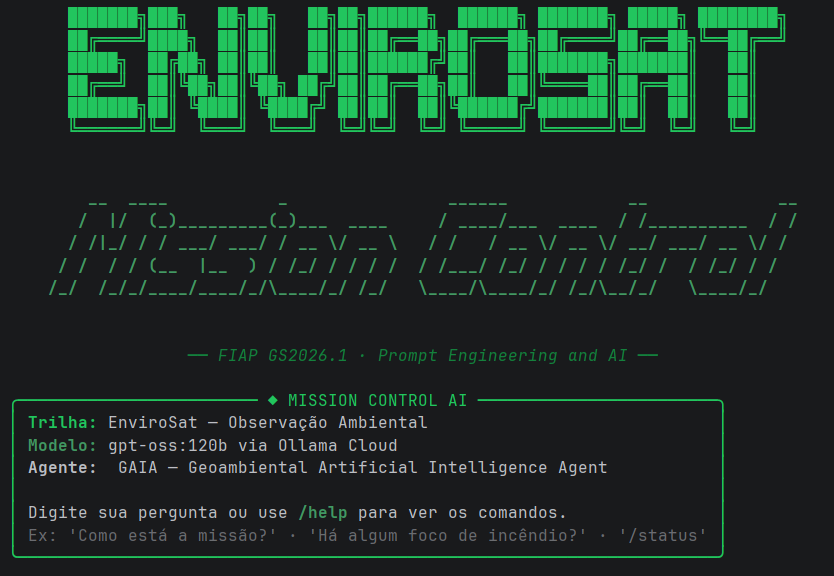
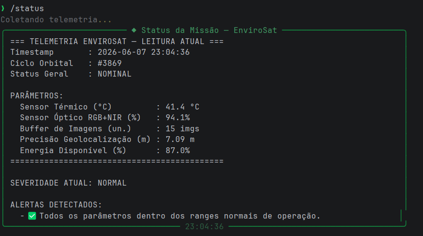

# Mission Control AI — EnviroSat

## Integrantes
- Kauanne Paula de Oliveira — RM: 574191 — Turma: 1CCPI
- Nayhely Estela Calle Castillo — RM: 571416 — Turma: 1CCPI

## O que o projeto faz
Sistema de monitoramento operacional do satélite EnviroSat, que simula telemetria de um satélite de observação ambiental e usa IA generativa (GAIA) para analisar os dados em linguagem natural. O sistema detecta focos de calor, degradação de sensores, gargalos de downlink e situações críticas de energia, traduzindo cada alerta em impacto concreto para operadores, brigadas de incêndio e analistas de compliance ambiental.

## Persona atendida
O sistema atende três perfis: o operador de centro de controle ambiental (INPE/órgão estadual), que precisa de dados técnicos precisos; o coordenador de brigada de combate a incêndio, que precisa saber onde agir e com que urgência; e o analista de compliance ambiental, que precisa de evidências confiáveis de desmatamento ou queimada ilegal. A GAIA identifica o perfil pelo contexto da pergunta e adapta o tom automaticamente.

## Tecnologias utilizadas
- Python 3.10+
- Ollama Cloud API — modelo gpt-oss:120b
- Rich 15.0.0 — painéis e formatação no terminal
- prompt-toolkit 3.0.52 — input editável com histórico
- pyfiglet 1.0.4 — banner ASCII
- python-dotenv 1.2.2 — gerenciamento de credenciais

## Como executar
1. Clone o repositório

```
git clone https://github.com/KauanneOliveira/mission-control-ai.git
cd mission-control-ai
```

2. Crie o ambiente virtual e ative

```
python -m venv .venv
.venv\Scripts\activate  # Windows
source .venv/bin/activate  # Linux/Mac
```

3. Instale as dependências

```
pip install -r requirements.txt
```

4. Crie o arquivo `.env` na raiz com sua chave Ollama
```
OLLAMA_API_KEY = sua_chave_aqui
```
5. Execute

```
python main.py
```

## Demonstração



## System Prompt
O system prompt completo está em `prompts/system_prompt.md`. Ele define a identidade da GAIA, as três camadas obrigatórias de resposta (diagnóstico técnico, impacto terrestre e recomendação de ação), as personas atendidas e as restrições de comportamento — incluindo a instrução de nunca usar markdown na saída para garantir formatação limpa no terminal.

## Cenários de teste demonstrados
1. Operação normal — todos os parâmetros dentro do range esperado
2. Foco de calor crítico — sensor térmico acima de 70°C com notificação automática de brigada
3. Sensor óptico degradado — imagens comprometidas, monitoramento de desmatamento suspenso
4. Energia crítica — modo emergência ativado automaticamente pelo sistema
5. Buffer saturado — captura de novas imagens pausada para evitar perda de dados

## Proposta de valor / modelo de negócio

**Problema terrestre que a missão resolve**
O Brasil perde milhões de hectares de vegetação nativa por ano para o desmatamento e incêndios. A detecção tardia é um dos principais fatores que dificultam a resposta das brigadas e dos órgãos de fiscalização. O EnviroSat resolve isso entregando análise de telemetria em linguagem natural, permitindo que operadores não especialistas tomem decisões rápidas com base nos dados orbitais.

**Quem paga pela solução**
Modelo híbrido: setor público (INPE, IBAMA, órgãos estaduais de meio ambiente) como cliente principal via contratos de monitoramento; e setor privado (empresas de compliance ESG, seguradoras rurais, cooperativas agrícolas) como cliente secundário via assinatura de relatórios ambientais baseados nos dados do satélite.

**Métrica de impacto**
Se o EnviroSat operar com 100% de disponibilidade por 1 ano: aproximadamente 2 milhões de hectares monitorados continuamente, redução estimada de 30% no tempo de resposta de brigadas a focos de incêndio em áreas protegidas, e cobertura de pelo menos 500 alertas de desmatamento encaminhados para fiscalização.

**Modelo de negócio**
Dado-como-serviço (DaaS) — os dados de telemetria processados e os relatórios gerados pela GAIA são entregues via API para plataformas parceiras (Embrapa Monitora, sistemas estaduais de alerta ambiental) e via dashboard para órgãos públicos contratantes. Complementado por assinatura mensal para empresas privadas que precisam de relatórios de compliance ambiental baseados em dados orbitais verificáveis.

## Limitações conhecidas
- A telemetria é simulada — os dados não vêm de um satélite real
- A chance de cenário crítico é configurável via código (padrão 10%), não reflete frequência real de anomalias
- O histórico de contexto mantém apenas os últimos 3 ciclos orbitais
- A GAIA pode apresentar pequenas variações de tom entre respostas consecutivas por ser um modelo não determinístico

## Vídeo de demonstração
[Assistir demonstração no YouTube](https://youtu.be/WKCgQUByq_Y)
> Configurado como "Não listado" no YouTube.

## Repositório
[Acessar repositório no GitHub](https://github.com/KauanneOliveira/mission-control-ai.git)
